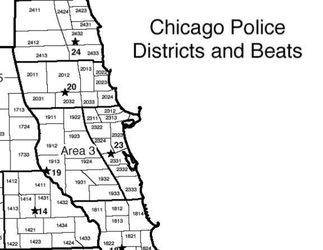

## Background

Due to language in the Chicago Police Department's [contract](https://www.dnainfo.com/chicago/20160106/downtown/inside-chicago-police-union-contract-document-shows-rules-of-force) officers who kill on the job are shielded from public disclosure, which is not the case in other major cities like Oakland.  Since City Hall and CPD won't identify killer officers, this guide should serve as a skeleton resource for victim's families, journalists, and others to identify the officers. Here are some basic steps you can take when a CPD officer shoots and kill someone, and how to gather information. This guide is loosely based on the [Chicago Reader](http://www.chicagoreader.com/Bleader/archives/2016/01/14/internal-police-records-point-to-the-identity-of-the-officer-who-fatally-shot-bettie-jones-and-quintonio-legrier) article confirming open source research that Lucy Parsons Labs was involved in. 

### Identify the District  
Chicago is broken up into twenty five districts and each police district is divided into three sectors. Each sector is further divided into three to five beats.  [Source](https://portal.chicagopolice.org/portal/page/portal/ClearPath/Get%20Involved/How%20CAPS%20works/KnowYourDistrict)  

To quote Chicago Police Department: 

> Each of the City's 281 police beats is numbered so that it can be uniquely identified:
>    The first one or two digits identify the district;
>     the next digit is the sector number;
>    and the last digit is the beat number.
> For example, Beat 521 is the 1st beat in the 2nd sector of the 5th Police District, and Beat 1913 is the 3rd beat in the 1st sector of the 19th Police District. Every beat patrol car has its beat number displayed on its roof.

To begin our analysis, we take the address of the shooting and/or cross streets and cross reference CPD's data to make sure it is accurate for beat, sector and district. In the past, we have used the Invisible Institute's
[database on police misconduct](http://invisible.institute/police-data/) complaints to confirm CPD's web portal for accuracy. District 11 and 01 might be confusing and could cause overlap because they both begin with 1.

### Scanner Traffic
After you have identified where the shooting occurred, you need to replay the [police scanner traffic](https://github.com/freddymartinez9/miscfoiamirror/blob/master/Zone11ShootingScanner/CPDBoxingDayShooting.mp3) of the date in question. You'll likely hear it on a particular Zone. It will rarely be on CityWide (CW) 2 or CW6 but it is possible. In the example above, we listened on Zone 2 for the shooting. You should cross reference a scanner guide like this [one found online](https://github.com/freddymartinez9/miscfoiamirror/blob/master/ChicagoScannerFrequencies.pdf) 

Once you've identified the Zone, you need to retrieve a copy of the Scanner traffic. You could either a) FOIA for it from the Office of Emergency Management and Communications (OEMC) or (b) download it from a resource like Broadcastify or other paid scanner webpages. OEMC will almost certainly block your FOIA, but its worth a shot (if they do turn down your request, contact us). Using that information, you can identify who responded to the dispatch call. In the example for the Chicago Reader, we heard the beat car responding was "1172 Robert" but that only provides the beat car number. 

### Identify the "Watch"
Chicago Police officers work work in 8-9 hour shifts called watches. For example, "First Watch" starts around 11pm-midnight but Police Officers clock in around 2230 on the night before the watch begins. That will be important in the next step.

## Pull the A&A for that Watch and District

This is still not enough to identify the officer. We now (hopefully) know the beat car that was on shift and responded, but we don't know *which* officers were in that car on that day.  The [Attendance and Assignment](https://github.com/freddymartinez9/miscfoiamirror/blob/master/Zone11ShootingScanner/FOIA15-7684A%26ASheet.pdf) (A&A sheet) breaks down the beat cars per watch and district for the time frame in question.  We sent a FOIA for A&A sheets for the entire District 11 for all of first watch for an entire week. You'll need to follow up vigorously on your FOIA. 

## Identify the Officer
*THIS IS THE HARD PART, BE CAREFUL*.  In previous experience, we had the name wrong three times before identifying the correct one. The A&A sheet will have officers clocking in, a given time and their assignment. From there, you can see 1172R was assigned to Rialmo. However, you have to be careful. For example, Rialmo was on shift on the 26th of December at 2230, even though he did shoot someone on shift on the *25th* of December at 0400. This is likely an artifact because the officers spend most of their shift on the 26th on first watch. Again, this is a very difficult and delicate task. 
Note: This is really CPD / City Hall's fault...if they had a policy of naming officers who shoot people, this wouldn't be so difficult. 

